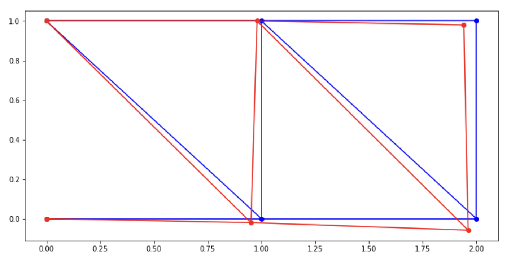

# Simulation

A collection of experiments with various simulation techniques

## Finite Element Solver

- Simple finite element method for 2D structural example [in the pin truss Notebook](fem_truss.ipynb)
- Element stiffness matrix initially derived with direct method
- Reading from: David Hutton, Fundamentals of Finite Element Analysis

### To Do

- Resolve stability issues complex truss
- Procedure for meshing a model
- Plot stress heatmap
- **Generalise element stiffness matrix derivation (method of weighted residuals)**

<br>



<br>

## Finite Difference Solver

- Simple finite difference solver [in the diffusion notebook](fdm_diffusion.ipynb)
- Essentially 2D smoothing filter applied each time step

<br>


<br>

## Particle Simulation

Simple particle simulation in [particle.py](particle.py)

<br>


<br>

## Graphics

For simulation visualisation, tested with a cellular automata example in [this python file](graphics_automata.py)

- Matplotlib animation is driving me crazy
- PyGame and OpenGL

```bash
python -m pip install -U pygame --user
python -m pip install PyOpenGL PyOpenGL_accelerate
```
<br>


